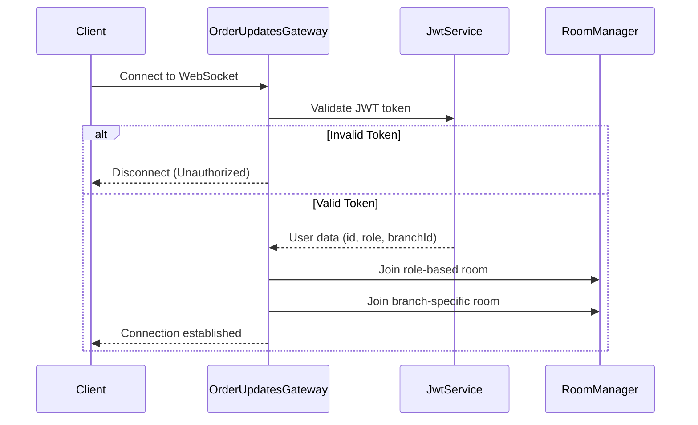

# Real-time WebSocket Communication Flow

## Overview

This document provides a comprehensive guide to the real-time WebSocket implementation in our POS system. The WebSocket functionality enables instant communication between the server and various clients, including staff interfaces, kitchen displays, and customer-facing applications.

## Architecture


### Components:

1. **OrderUpdatesGateway**: Central WebSocket gateway handling connections, authentication, and event broadcasting
2. **WebSocket Namespaces**: Organized under `/orders` for order-related events
3. **Room-based Broadcasting**: Events are broadcast to specific rooms based on roles, branches, orders, and desks
4. **JWT Authentication**: Secure WebSocket connections using JWT tokens
5. **Integration Points**: OrderService, StockService, and other services emit events through the gateway

## Connection Flow



## Authentication

The WebSocket gateway uses JWT authentication to secure connections:

```typescript
// Extract and validate JWT token
const token = client.handshake.auth.token || client.handshake.headers.authorization?.split(' ')[1];
if (!token) {
  return false;
}

try {
  // Verify the token and extract user data
  const payload = this.jwtService.verify(token);
  client.user = payload;
  return true;
} catch (error) {
  return false;
}
```

## Room Management

Clients are automatically assigned to rooms based on their role and branch:

### Room Types:

1. **Role-based rooms**: `role:ADMIN`, `role:MANAGER`, `role:STAFF`, `role:CUSTOMER`
2. **Branch-specific rooms**: `branch:1`, `branch:2`, etc.
3. **Order-specific rooms**: `order:123`, `order:456`, etc.
4. **Desk-specific rooms**: `desk:1`, `desk:2`, etc.

### Room Assignment:

```typescript
// Join role-based room
client.join(`role:${client.user.role}`);

// Join branch-specific room if user has a branch
if (client.user.branchId) {
  client.join(`branch:${client.user.branchId}`);
}
```

### Dynamic Room Joining:

Clients can also join specific rooms for orders or desks:

```typescript
@SubscribeMessage('joinOrderRoom')
handleJoinOrderRoom(client: AuthenticatedSocket, orderId: string): void {
  client.join(`order:${orderId}`);
  return { success: true, room: `order:${orderId}` };
}

@SubscribeMessage('leaveOrderRoom')
handleLeaveOrderRoom(client: AuthenticatedSocket, orderId: string): void {
  client.leave(`order:${orderId}`);
  return { success: true };
}
```

## Event Types

### Order Events:

1. **orderCreated**: Emitted when a new order is placed
   ```typescript
   this.server.to(`branch:${order.branchId}`).emit('orderCreated', {
     orderId: order.id,
     orderNumber: order.orderNumber,
     items: order.items.length,
     total: order.total,
     status: order.status,
     timestamp: new Date(),
   });
   ```

2. **orderStatusChanged**: Emitted when an order's status changes
   ```typescript
   this.server.to(`branch:${order.branchId}`).to(`order:${order.id}`).emit('orderStatusChanged', {
     orderId: order.id,
     orderNumber: order.orderNumber,
     previousStatus: previousStatus,
     currentStatus: order.status,
     timestamp: new Date(),
   });
   ```

3. **orderCancelled**: Emitted when an order is cancelled
   ```typescript
   this.server.to(`branch:${order.branchId}`).to(`order:${order.id}`).emit('orderCancelled', {
     orderId: order.id,
     orderNumber: order.orderNumber,
     reason: reason,
     timestamp: new Date(),
   });
   ```

4. **paymentReceived**: Emitted when payment is processed for an order
   ```typescript
   this.server.to(`branch:${order.branchId}`).to(`order:${order.id}`).emit('paymentReceived', {
     orderId: order.id,
     orderNumber: order.orderNumber,
     amount: payment.amount,
     method: payment.method,
     change: payment.change,
     timestamp: new Date(),
   });
   ```

### Kitchen Alerts:

1. **kitchenAlert**: Notifies kitchen staff about order events
   ```typescript
   this.server.to(`role:STAFF`).to(`branch:${branchId}`).emit('kitchenAlert', {
     type: alertType, // NEW_ORDER, URGENT, READY
     orderId: orderId,
     orderNumber: orderNumber,
     message: message,
     timestamp: new Date(),
   });
   ```

### Inventory Alerts:

1. **inventoryAlert**: Notifies staff about inventory issues
   ```typescript
   this.server.to(`role:ADMIN`).to(`role:MANAGER`).emit('inventoryAlert', {
     type: alertType, // LOW_STOCK, OUT_OF_STOCK, EXPIRING
     ingredientId: ingredientId,
     ingredientName: ingredientName,
     branchId: branchId,
     currentStock: currentStock,
     threshold: threshold,
     message: message,
     timestamp: new Date(),
   });
   ```

## Integration with Services

### OrderService Integration:

The OrderService emits events at key points in the order lifecycle:

```typescript
// When creating a new order
async createOrder(createOrderDto: CreateOrderDto): Promise<Order> {
  // ... order creation logic ...
  
  // Emit WebSocket event for new order
  this.orderUpdatesGateway.emitOrderCreated(order);
  
  // Emit kitchen alert for new order
  this.orderUpdatesGateway.emitKitchenAlert(
    order.branchId,
    order.id,
    order.orderNumber,
    KitchenAlertType.NEW_ORDER,
    `New order #${order.orderNumber} received`
  );
  
  return order;
}
```

### StockService Integration:

The StockService emits inventory alerts when stock levels change:

```typescript
async checkAndEmitStockAlerts(stockItem: Stock): Promise<void> {
  // Check for low stock
  if (stockItem.currentQuantity <= stockItem.minQuantity && stockItem.currentQuantity > 0) {
    this.orderUpdatesGateway.emitInventoryAlert(
      InventoryAlertType.LOW_STOCK,
      stockItem.ingredientId,
      stockItem.ingredient.name,
      stockItem.branchId,
      stockItem.currentQuantity,
      stockItem.minQuantity,
      `Low stock alert: ${stockItem.ingredient.name} is running low (${stockItem.currentQuantity} ${stockItem.ingredient.unit} remaining)`
    );
  }
  
  // Check for out of stock
  if (stockItem.currentQuantity <= 0) {
    this.orderUpdatesGateway.emitInventoryAlert(
      InventoryAlertType.OUT_OF_STOCK,
      stockItem.ingredientId,
      stockItem.ingredient.name,
      stockItem.branchId,
      0,
      stockItem.minQuantity,
      `Out of stock alert: ${stockItem.ingredient.name} is out of stock!`
    );
  }
  
  // Check for expiring items
  if (stockItem.expiryDate && isWithinDays(stockItem.expiryDate, 3)) {
    this.orderUpdatesGateway.emitInventoryAlert(
      InventoryAlertType.EXPIRING,
      stockItem.ingredientId,
      stockItem.ingredient.name,
      stockItem.branchId,
      stockItem.currentQuantity,
      null,
      `Expiry alert: ${stockItem.ingredient.name} is expiring on ${formatDate(stockItem.expiryDate)}`
    );
  }
}
```

## Testing WebSocket Functionality

### WebSocket Test Client

A WebSocket test client is available at `/websocket-test.html` for interactive testing of the WebSocket functionality:

1. **Authentication**: Enter JWT token to establish a secure connection
2. **Room Management**: Join/leave specific rooms
3. **Event Monitoring**: View real-time events with timestamps
4. **API Testing**: Trigger events via REST API for testing

### Connection Example:

```javascript
// Connect to the WebSocket server
const socket = io('http://localhost:3001/orders', {
  auth: {
    token: 'your-jwt-token'
  }
});

// Listen for events
socket.on('orderCreated', (data) => {
  console.log('New order created:', data);
});

socket.on('kitchenAlert', (data) => {
  console.log('Kitchen alert:', data);
});

// Join a specific order room
socket.emit('joinOrderRoom', '123');
```

## Security Considerations

1. **JWT Authentication**: All WebSocket connections require valid JWT tokens
2. **Role-based Access**: Events are broadcast only to authorized roles
3. **Branch Isolation**: Staff only receive events for their assigned branch
4. **Connection Validation**: Connections without valid tokens are rejected
5. **Error Handling**: Comprehensive error handling for connection issues

## Frontend Integration

### Web Dashboard:

```typescript
// Dashboard component
import { io, Socket } from 'socket.io-client';

export class DashboardComponent implements OnInit, OnDestroy {
  private socket: Socket;
  
  constructor(private authService: AuthService) {}
  
  ngOnInit() {
    // Get JWT token from auth service
    const token = this.authService.getToken();
    
    // Connect to WebSocket server
    this.socket = io('http://localhost:3001/orders', {
      auth: { token }
    });
    
    // Listen for events
    this.socket.on('orderCreated', (data) => {
      this.handleNewOrder(data);
    });
    
    this.socket.on('inventoryAlert', (data) => {
      this.showInventoryAlert(data);
    });
  }
  
  ngOnDestroy() {
    // Clean up socket connection
    if (this.socket) {
      this.socket.disconnect();
    }
  }
}
```

### Kitchen Display:

```typescript
// Kitchen display component
export class KitchenDisplayComponent implements OnInit {
  private socket: Socket;
  
  constructor(private authService: AuthService) {}
  
  ngOnInit() {
    // Connect with kitchen staff credentials
    const token = this.authService.getToken();
    
    this.socket = io('http://localhost:3001/orders', {
      auth: { token }
    });
    
    // Listen for kitchen alerts
    this.socket.on('kitchenAlert', (data) => {
      if (data.type === 'NEW_ORDER') {
        this.addOrderToQueue(data);
      } else if (data.type === 'URGENT') {
        this.highlightUrgentOrder(data);
      }
    });
  }
}
```

## Troubleshooting

### Common Issues:

1. **Connection Refused**:
   - Check if the server is running
   - Verify CORS settings in main.ts
   - Ensure the client is using the correct WebSocket URL

2. **Authentication Failed**:
   - Verify JWT token is valid and not expired
   - Check if token is properly included in connection request
   - Confirm JWT secret matches between client and server

3. **Missing Events**:
   - Ensure client has joined the correct rooms
   - Check if user has appropriate role for the events
   - Verify the event name matches exactly between client and server

4. **Performance Issues**:
   - Monitor number of concurrent connections
   - Check for memory leaks from unmanaged connections
   - Consider implementing rate limiting for high-traffic scenarios

## Best Practices

1. **Disconnection Handling**: Always handle disconnections gracefully on both client and server
2. **Reconnection Strategy**: Implement exponential backoff for reconnection attempts
3. **Error Handling**: Provide meaningful error messages for debugging
4. **Room Management**: Leave rooms when they're no longer needed
5. **Event Naming**: Use consistent naming conventions for events
6. **Payload Size**: Keep event payloads small and focused
7. **Logging**: Implement appropriate logging for connection events and errors

## Conclusion

The WebSocket implementation provides a robust foundation for real-time communication in the POS system. By leveraging room-based broadcasting and role-based access control, the system ensures that information is delivered securely and efficiently to the appropriate users.
